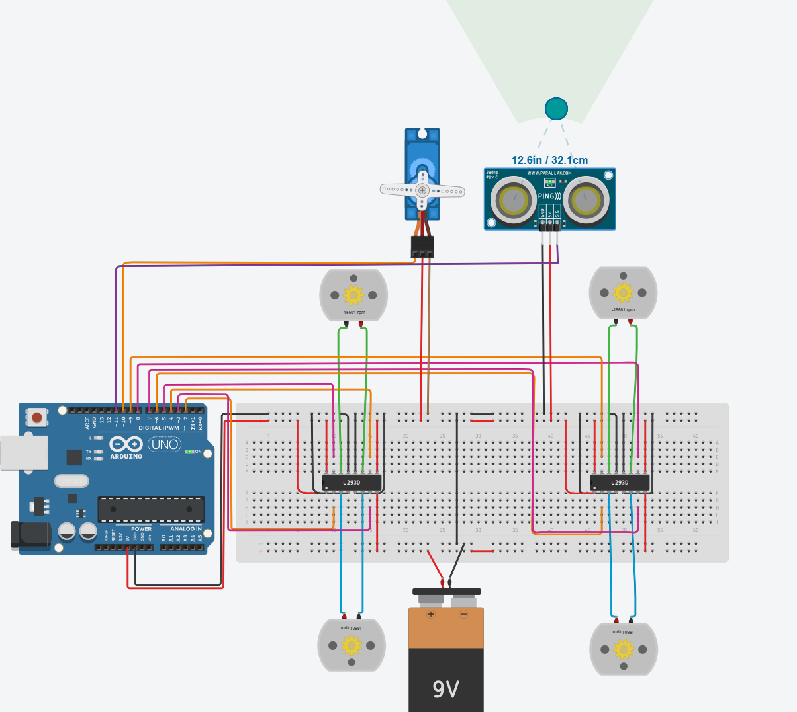

# Obstacle Avoidance System

An Arduino-based obstacle avoidance simulation that controls four DC motors using two L293D motor drivers. A PING ultrasonic sensor detects nearby obstacles, while a servo motor scans the surrounding area before the system changes its movement direction.

## Tinkercad Simulation

[Open the Tinkercad Simulation](https://www.tinkercad.com/things/aVZPxhyibfF/editel?sharecode=6DkblEnwFYFL4YE3U4OT2xsfCF_U_BFb07sBl_pWbCM)

---

## Simulation Demo

[Watch the Simulation Demo](Simulation_Demo.mp4)

---

## Project Overview

This project demonstrates an obstacle avoidance system designed and tested using Tinkercad Circuits.

The system continuously measures the distance in front of it using a PING ultrasonic sensor.

When no obstacle is detected within 10 centimeters, the four DC motors continue moving the system forward.

When an obstacle is detected at a distance of 10 centimeters or less, the system:

1. Stops all four DC motors.
2. Moves the servo motor to scan both sides.
3. Returns the servo motor to the center position.
4. Moves backward temporarily.
5. Changes its movement direction.
6. Continues checking the distance for new obstacles.

---

## Circuit Diagram



---

## Components

| Component | Quantity |
|---|---:|
| Arduino Uno R3 | 1 |
| L293D Motor Driver | 2 |
| DC Motor | 4 |
| PING Ultrasonic Distance Sensor | 1 |
| Micro Servo Motor | 1 |
| Breadboard | 1 |
| 9V Battery | 1 |
| Jumper Wires | As required |

---

## Arduino Pin Configuration

### First L293D Motor Driver

| Arduino Pin | L293D Input Pin |
|---|---:|
| D2 | Pin 2 |
| D3 | Pin 7 |
| D4 | Pin 10 |
| D5 | Pin 15 |

### Second L293D Motor Driver

| Arduino Pin | L293D Input Pin |
|---|---:|
| D6 | Pin 2 |
| D7 | Pin 7 |
| D8 | Pin 10 |
| D9 | Pin 15 |

### Sensor and Servo Connections

| Component | Connection |
|---|---|
| Servo signal | Arduino D10 |
| Ultrasonic SIG | Arduino D11 |
| Servo power | Arduino 5V |
| Servo ground | Common GND |
| Ultrasonic power | Arduino 5V |
| Ultrasonic ground | Common GND |

---

## Motor Driver Connections

Each L293D motor driver controls two DC motors.

| L293D Output Pins | Connected Motor |
|---|---|
| Pins 3 and 6 | First motor |
| Pins 11 and 14 | Second motor |

Two L293D motor drivers are used to control all four motors.

---

## Power Connections

The circuit uses separate power connections for the control components and the DC motors.

- Arduino 5V supplies the logic section of both L293D motor drivers.
- Arduino 5V also supplies the ultrasonic sensor and servo motor in the simulation.
- The external 9V battery supplies the motor voltage.
- The Arduino ground, battery negative terminal, sensor ground, servo ground, and L293D ground pins are connected together.
- The common ground allows all components to use the same voltage reference.

The DC motors are not powered directly from the Arduino digital pins.

---

## Operating Logic

### Normal Operation

When the measured distance is greater than 10 centimeters:

- The four DC motors move the system forward.
- The servo motor remains centered at 90 degrees.
- The ultrasonic sensor continues measuring the distance.

### Obstacle Detected

When the measured distance is 10 centimeters or less:

- All four motors stop immediately.
- The servo moves to 30 degrees.
- The servo then moves to 150 degrees.
- The servo returns to 90 degrees.
- The motors move backward temporarily.
- The system performs a right turn.
- Distance measurement continues.

---

## Distance Measurement

The PING ultrasonic sensor uses one signal pin for both transmitting and receiving the ultrasonic pulse.

The Arduino:

1. Sends a short trigger pulse through D11.
2. Changes D11 to input mode.
3. Measures the returning pulse duration.
4. Converts the duration into distance in centimeters.

The distance is calculated using:

```cpp
distance = duration * 0.034 / 2;
```

The value is divided by two because the ultrasonic wave travels to the obstacle and returns to the sensor.

---

## Servo Scanning Positions

| Servo Position | Purpose |
|---:|---|
| 30° | Scan one side |
| 90° | Center position |
| 150° | Scan the opposite side |

The servo remains centered during normal movement and scans both sides when an obstacle is detected.

---

## Code Structure

The Arduino program is divided into separate functions to make it organized and easy to modify.

- `readDistanceCM()` measures the distance using the ultrasonic sensor.
- `avoidObstacle()` performs the complete obstacle avoidance sequence.
- `moveForward()` moves the system forward.
- `moveBackward()` moves the system backward.
- `turnRight()` changes the movement direction.
- `stopMotors()` stops all four DC motors.

---

## Challenges and Solutions

### 1. Controlling Four DC Motors

**Challenge:**  
A single L293D motor driver can independently control only two DC motors.

**Solution:**  
Two L293D motor drivers were used. Each driver controls two motors, allowing the Arduino to control all four motors.

---

### 2. Using a Single-Pin Ultrasonic Sensor

**Challenge:**  
The PING ultrasonic sensor uses one SIG pin instead of separate trigger and echo pins.

**Solution:**  
Arduino D11 was first configured as an output to send the ultrasonic trigger pulse. It was then changed to an input to receive and measure the returning pulse.

---

### 3. Creating a Common Ground

**Challenge:**  
The Arduino, motor battery, motor drivers, sensor, and servo require the same voltage reference.

**Solution:**  
All ground connections were connected together to create a common ground.

---

### 4. Detecting Obstacles at the Required Distance

**Challenge:**  
The system needed to react only when an obstacle was located at 10 centimeters or less.

**Solution:**  
A conditional statement was added to compare every measured distance with the 10-centimeter threshold.

```cpp
if (distance > 10 || distance == 0) {
  moveForward();
} else {
  avoidObstacle();
}
```

---

### 5. Coordinating the Motors and Servo

**Challenge:**  
The motors had to stop before the servo began scanning.

**Solution:**  
The `avoidObstacle()` function stops all four motors before moving the servo and changing the system direction.

---

### 6. Verifying Motor Direction

**Challenge:**  
Motors installed on opposite sides appeared to rotate in different visual directions.

**Solution:**  
The motor control values were adjusted so that the four motors represent wheels moving the complete system in the intended physical direction.

---

### 7. Organizing the Circuit

**Challenge:**  
The circuit contained four motors, two motor drivers, a sensor, a servo, an Arduino, and multiple power connections.

**Solution:**  
The components were arranged symmetrically and the wires were organized using straight paths and consistent colors.

- Red wires represent positive power.
- Black wires represent ground.
- Green and blue wires connect the DC motors.
- Orange and pink wires represent Arduino control signals.
- Purple is used for the ultrasonic sensor signal.

---

## Testing Process

The system was tested using two different distance conditions.

### Test 1: Clear Path

The sensor distance was set above 10 centimeters.

**Result:**

- All four motors moved forward.
- The servo remained centered.
- No obstacle avoidance sequence was activated.

### Test 2: Obstacle Detected

The sensor distance was set to 10 centimeters or less.

**Result:**

- All four motors stopped.
- The servo scanned both sides.
- The motors reversed temporarily.
- The system changed direction.
- Normal movement resumed after the avoidance sequence.

---

## Final Result

The final simulation successfully:

- Controlled four DC motors using two L293D motor drivers.
- Measured distance using a PING ultrasonic sensor.
- Detected obstacles at 10 centimeters or less.
- Stopped all four motors when an obstacle was detected.
- Moved the servo motor to scan both sides.
- Reversed and changed direction to avoid the obstacle.
- Continued normal movement when the path was clear.
- Completed the simulation without errors.

---

## Project Files

```text
Obstacle-Avoidance-System/
│
├── Obstacle_Avoidance.ino
├── Circuit.png
├── Simulation_Demo.mp4
└── README.md
```

---

## Important Note

This project was designed and tested as a Tinkercad simulation.

For physical implementation, the servo motor and four DC motors may require a suitable regulated external power supply. The selected supply must meet the voltage and current requirements of all connected motors.

---

## Submitted By

**Reem Al-Wadaei**  
Smart Methods Robotics Engineering Training
