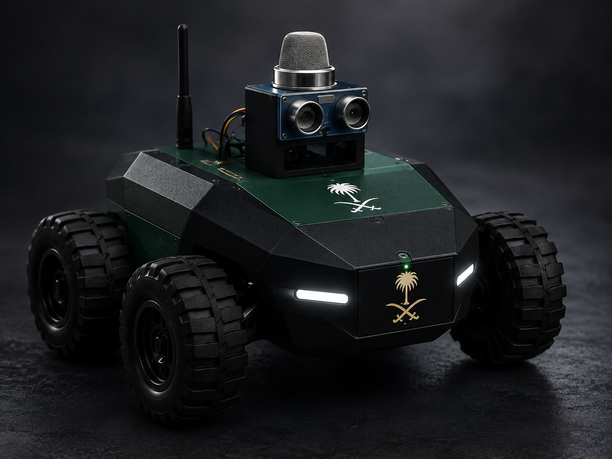
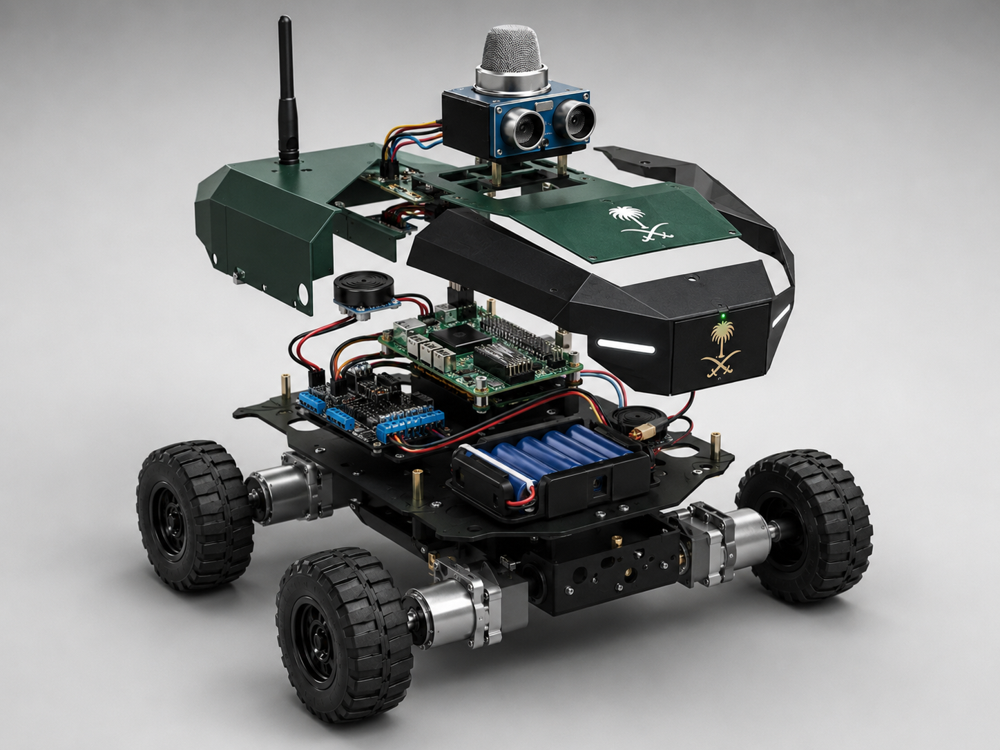

# Circuit Design Simulation Task Part 2: Obstacle Avoidance

  <em>Conceptual design of a future gas leak detection upgrade.</em>

## Overview
This project presents an Arduino-based obstacle avoidance system designed to simulate an intelligent vehicle.  
The system uses an ultrasonic sensor to detect nearby obstacles and a servo motor to scan the surrounding area.  
When an obstacle is detected within a short distance, the vehicle stops, scans the environment, moves backward, and then continues moving safely.

This project demonstrates the basic concept of smart navigation using Arduino, sensors, and motor control.

---

## Objectives
The main objectives of this project are:

- Build a smart vehicle simulation using Arduino
- Detect obstacles using an ultrasonic sensor
- Stop automatically when an obstacle is too close
- Rotate a servo motor to scan the environment
- Allow the vehicle to react and continue moving safely

---

## Components Used
- Arduino Uno
- L293D Motor Driver
- 4 DC Motors
- HC-SR04 Ultrasonic Sensor
- Servo Motor
- 9V Battery
- Breadboard
- Jumper Wires

---

## System Behavior
The system works as follows:

1. The vehicle moves forward normally.
2. The ultrasonic sensor continuously measures the distance in front of the vehicle.
3. If the distance is greater than 10 cm, the vehicle keeps moving forward.
4. If the distance is 10 cm or less:
   - The vehicle stops
   - The servo motor rotates from 0° to 180° and returns to 0°
   - The vehicle moves backward
   - Then it continues moving again

---

## Circuit Diagram

---

## Project Files
- `Obstacle_Avoidance.ino` – Arduino source code
- `Circuit.png` – Circuit connection image
- `Simulation_Demo.mp4` – Simulation demo video
- `Gas_Leak_Vehicle.png` – Future concept vehicle image
- `Gas_Leak_Vehicle_Exploded.png` – Internal concept view
- `README.md` – Project documentation

---

## Simulation Video
[Watch the Simulation Demo](Simulation_Demo.mp4)

---

## Programming Logic
The Arduino code is responsible for:

- Reading the distance from the ultrasonic sensor
- Controlling the DC motors using the L293D motor driver
- Rotating the servo motor for scanning
- Stopping and reversing the vehicle when an obstacle is detected
- Resuming movement after scanning

---

## Output
This simulation successfully demonstrates:

- Obstacle detection
- Automatic stop response
- Servo scanning motion
- Reverse movement after obstacle detection
- Basic intelligent vehicle behavior

---

## Future Development
This project can be further improved by adding more smart features and safety functions.

One possible future enhancement is upgrading the vehicle into a **Smart Gas Leak Detection Vehicle** for hazardous environments.

This upgraded concept may include:

- Gas sensor for leak detection
- Warning LED indicators
- Buzzer alarm system
- Safer inspection in dangerous areas
- Intelligent monitoring for industrial use

### Internal Concept View

This concept shows how the current obstacle avoidance system can be expanded into a more advanced smart safety vehicle.

---

## Conclusion
This project demonstrates a simple and effective obstacle avoidance system using Arduino.  
It combines sensing, motion control, and basic decision-making to simulate an intelligent vehicle.  
It also provides a strong foundation for future developments such as gas leak detection and smart safety inspection systems.
